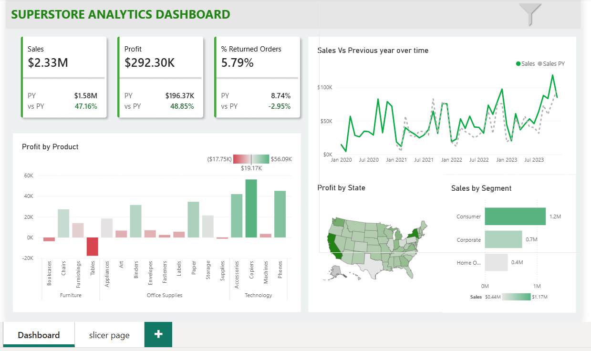

# 📊 Global Superstore Revenue Intelligence Dashboard


An end-to-end Business Intelligence project built using **PostgreSQL, Python, Power BI, and DAX** to analyze the Global Superstore dataset. This project demonstrates the complete BI workflow—from cleaning raw data to building an interactive dashboard that helps answer real business questions.

---

# 📷 Dashboard Preview

The dashboard provides an interactive view of sales performance, profitability, customer behavior, and regional trends.



---
## 📥 Download the Dashboard

The complete interactive Power BI report is available in the **dashboard** folder.

📄 **File:** `Global_superstore_dashboard.pbix`

> Open the `.pbix` file using **Microsoft Power BI Desktop** to explore the interactive report, slicers, and DAX measures.

---

# 📌 Project Summary

| Metric | Details |
|---------|---------|
| Dataset | Global Superstore |
| Total Records | 51,290 |
| Database | PostgreSQL |
| Programming Language | Python |
| Visualization Tool | Power BI |
| Dashboard Pages | 2 |
| DAX Measures | Sales, Profit, Previous Year Sales, Return Rate, YoY Comparison |
| Business Questions Solved | 10+ |

---

# 📌 Project Overview

Retail businesses generate thousands of sales transactions every day. While the data contains valuable information, it becomes difficult to identify trends, monitor performance, and make informed business decisions without proper analysis.

In this project, I developed an end-to-end Business Intelligence solution that transforms raw retail sales data into meaningful insights. Using SQL for data preparation, Python for exploratory analysis, and Power BI for visualization, I built an interactive dashboard that allows users to monitor key business metrics and explore sales performance across different regions, products, and customer segments.

---

# 🎯 Business Problem

The objective of this project was to answer important business questions such as:

- Which markets generate the highest revenue?
- Which product categories are the most profitable?
- Who are the highest-value customers?
- How are sales changing over time?
- Which regions require greater business attention?
- What is the return rate across orders?

---

# 🛠️ Tools & Technologies

- PostgreSQL
- SQL
- Python
- Pandas
- Matplotlib
- Power BI
- DAX
- Git
- GitHub

---

# 🔄 Project Workflow

```
Global Superstore Dataset
            │
            ▼
Import into PostgreSQL
            │
            ▼
Data Cleaning & Validation
            │
            ▼
Business Analysis using SQL
            │
            ▼
Exploratory Data Analysis using Python
            │
            ▼
Power BI Data Modeling
            │
            ▼
DAX Measure Creation
            │
            ▼
Interactive Dashboard
            │
            ▼
Business Insights & Recommendations
```

---

# 🗄️ SQL Analysis

## Data Preparation

The dataset was prepared using PostgreSQL by:

- Importing the Global Superstore dataset
- Renaming columns using snake_case naming convention
- Checking for missing values
- Validating data quality
- Formatting date columns
- Preparing the dataset for business analysis

## Business Questions Solved

The SQL analysis answered several business questions including:

- Total Sales
- Total Profit
- Profit Margin
- Sales by Market
- Sales by Region
- Sales by Category
- Top Customers
- Top Products
- Monthly Sales Trend
- Year-over-Year Growth
- Month-over-Month Growth
- Running Revenue Analysis

## SQL Concepts Used

- Aggregate Functions
- GROUP BY
- CASE WHEN
- Common Table Expressions (CTEs)
- Window Functions
- RANK()
- LAG()
- DATE_TRUNC()
- EXTRACT()

---

# 🐍 Python Analysis

Python was used to perform exploratory data analysis and identify business trends before building the dashboard.

The analysis included:

- Data cleaning
- Sales trend analysis
- Regional performance analysis
- Product category analysis
- Customer analysis
- Business insights
- Data visualization

### Libraries Used

- Pandas
- Matplotlib

---

# 📊 Power BI Dashboard

The Power BI dashboard was designed to provide an interactive and user-friendly experience.

### Dashboard Features

- Executive KPI Cards
- Interactive Slicers
- Sales Trend Analysis
- Profit Analysis
- Product Performance
- Regional Performance
- Customer Analysis
- Time Intelligence using DAX
- Previous Year Comparison
- Return Order Analysis

---

# 💡 Key Business Insights

- APAC generated the highest overall sales among all markets.
- Technology products delivered the highest revenue and profitability.
- Consumer customers contributed the largest share of total sales.
- A small number of customers generated a significant portion of overall revenue.
- Heavy discounting reduced profitability for several high-selling products.
- Sales showed consistent growth over time with seasonal peaks.
- The overall return rate remained relatively low, indicating efficient order fulfillment.

---

# 📈 Skills Demonstrated

This project helped strengthen practical skills in:

- SQL Query Writing
- PostgreSQL
- Data Cleaning
- Exploratory Data Analysis
- Python
- Power BI
- DAX
- Data Modeling
- Dashboard Design
- KPI Development
- Business Intelligence
- Data Visualization
- Business Storytelling
- Git & GitHub

---

# 📚 What I Learned

While working on this project, I gained hands-on experience in:

- Writing business-focused SQL queries
- Using Window Functions and Common Table Expressions
- Cleaning and preparing real-world datasets
- Creating reusable DAX measures
- Building interactive Power BI dashboards
- Designing dashboards for business users
- Presenting analytical findings through visual storytelling

---

# 🚀 Future Improvements

Planned enhancements include:

- Customer Segmentation (RFM Analysis)
- Sales Forecasting
- Drill-through Pages
- Dynamic Tooltips
- Advanced DAX Measures
- Power BI Service Deployment

---

# 🎯 Conclusion

This project demonstrates the complete Business Intelligence workflow—from importing raw data into PostgreSQL to creating an interactive Power BI dashboard.

By combining SQL, Python, and Power BI, the project transforms transactional retail data into meaningful insights that can help businesses monitor performance, identify opportunities for growth, and support data-driven decision-making.

If you have any feedback or suggestions, feel free to connect or raise an issue in this repository.
